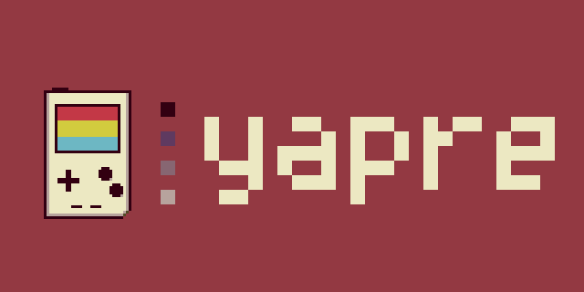
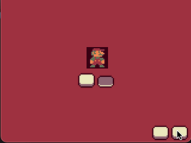
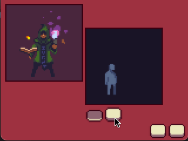
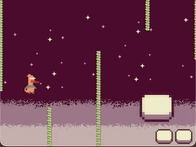

# yapre



**Build Status**

|windows|mac|linux|emscripten|
|-------|-------|-------|-------|
||||

## Intro

Here comes Yet Another Portable Retro Engine(yapre)!

It is a toy project for everyone to make retro games on any platform(for now Windows, MacOS, Linux, emscripten, iOS and Android are supported) using C++ and lua.

Try the demo app in your webbrowser by typping [yapre.run](https://yapre.run) in your address bar!


## Examples







## Build

### windows

```
> cd yapre
> .\build_scripts\build_windows.bat
```

### mac

```
> cd yapre
> sh ./build_scripts/build_mac.sh
```

### linux

```
> cd yapre
> sh ./build_scripts/build_linux.sh
```

### generate ios xcode project on mac

#### for devices

```
> cd yapre
> sh ./build_scripts/build_ios.sh
```

#### for simulators

```
> cd yapre
> sh ./build_scripts/build_ios_simulator.sh
```

### generate android studio project on mac

```
> cd yapre
> sh ./build_scripts/build_android.sh
```

### build emscripten version on mac/linux

#### build

```
> cd yapre
> sh ./build_scripts/build_emscripten.sh
```

#### test run

```
> sh ./build_scripts/run_emscripten.sh
```

## API

### System

Init()

Deinit()

Update()

yapre.platform

yapre.Exit()

yapre.AddTimer(time_ms, callback_function)

### Audio

yapre.Beep(freq, duration_ms)

### Video

yapre.RenderSize(width, height)

yapre.SetClearColor(r, g, b, a)

yapre.DrawSprite(texture_path, x, y, z, width, height, rotate, r, g, b)

### Input

yapre.BindKeyboardInputCallback(key, callback_function)

yapre.UnbindKeyboardInputCallback(key)

yapre.BindMouseInputCallback(key, callback_function)

yapre.UnbindMouseInputCallback(key)

yapre.BindTouchInputCallback(key, callback_function)

yapre.UnbindTouchInputCallback(key)

